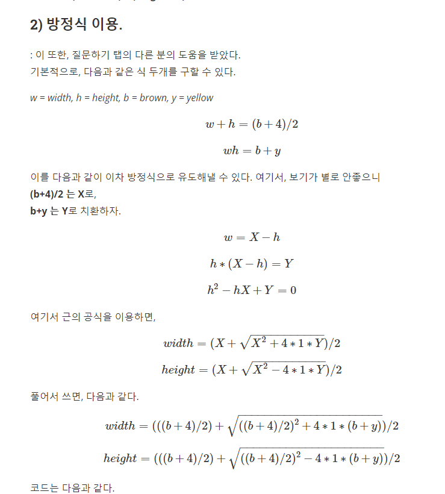

# 카펫 - 해시

### https://programmers.co.kr/learn/courses/30/lessons/42842- 문제 링크

이 문제는 완전탐색 방식보다 수학적으로 푸는 방법이 존재한다.

### 수학적으로으로 풀기
1. a는 (brown + 4) / 2, b는 brown + yellow로 초기화 해준다. 
2. (a^2 - 4b)의 제곱근을 담은 sqrt란 더블형 변수를 초기화한다.
3. 가로는 (a + sqrt) / 2, 세로는 (a - sqrt) / 2로 반환 한다.
4. 소수가 맞다면 정답으로 반환 할 변수에 값을 1씩 증감 시킨 뒤 반환합니다.

출처 : https://cjlee38.github.io/problem-solving/problem_solving_9
